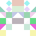
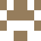
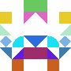
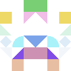
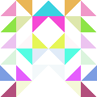
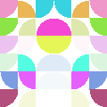

 NIdenticon
==========

> "*An Identicon is a visual representation of a hash value, usually of an IP address, that serves to identify a user of a computer system as a form of avatar while protecting the users' privacy. The original Identicon was a 9-block graphic, and the representation has been extended to other graphic forms by third parties.*"
– [Wikipedia](http://en.wikipedia.org/wiki/Identicon)

NIdenticon is a library (available as [NuGet package](https://www.nuget.org/packages/NIdenticon)) that helps creating simple Identicons but is flexible enough to allow for tweaking the output to your heart's content.

This project was inspired by:
 * [Github – Identicons!](https://github.com/blog/1586-identicons)
 * [David Hamp-Gonsalves – Generating Identicons](http://www.davidhampgonsalves.com/Identicons)
 * [Phil Haack – Identicons as Graphical Digital Fingerprints](http://haacked.com/archive/2007/01/22/Identicons_as_Visual_Fingerprints.aspx)
 * [Jeff Atwood – Identicons for .NET](http://www.codinghorror.com/blog/2007/01/identicons-for-net.html)

## Usage

The most basic example is as follows:
```c#
var g = new IdenticonGenerator();
var mybitmap = g.Create("foo");
````

This will create an Identicon based on the string `foo` with all other options default; another example is:
```c#
var g = new IdenticonGenerator();
var mybitmap = g.Create(HttpContext.Current.Request.UserHostAddress);
````

This creates an Identicon based on the IP-address of a remote host. The Identicon can be created with the following options:

* Dimensions (width, height **default**: 400, 400)
* Number of blocks, or "pixels" (horizontal, vertical **default**: 6, 6)
* Hash algorithm (**default**: `SHA512`)
* Background color (**default**: `Transparent`)
* Even the default string-encoding used can be specified (**default**: UTF-8)

This library only contains one the `IdenticonGenerator` that has only one method: `Create()`, but which is rich in overloads. These are:
```c#
Bitmap Create(byte[] value)
Bitmap Create(byte[] value, Size size)
Bitmap Create(byte[] value, Size size, Color backgroundcolor)
Bitmap Create(byte[] value, Size size, Color backgroundcolor, Size blocks)
Bitmap Create(byte[] value, Size size, Color backgroundcolor, Size blocks, IBlockGenerator[] blockgenerators)
Bitmap Create(byte[] value, Size size, Color backgroundcolor, Size blocks, IBlockGenerator[] blockgenerators, IBrushGenerator brushgenerator)
Bitmap Create(byte[] value, Size size, Color backgroundcolor, Size blocks, IBlockGenerator[] blockgenerators, IBrushGenerator brushgenerator, string algorithm)
Bitmap Create(IPAddress ipaddress)
Bitmap Create(IPAddress ipaddress, Size size)
Bitmap Create(IPAddress ipaddress, Size size, Color backgroundcolor)
Bitmap Create(IPAddress ipaddress, Size size, Color backgroundcolor, Size blocks)
Bitmap Create(IPAddress ipaddress, Size size, Color backgroundcolor, Size blocks, IBlockGenerator[] blockgenerators)
Bitmap Create(IPAddress ipaddress, Size size, Color backgroundcolor, Size blocks, IBlockGenerator[] blockgenerators, IBrushGenerator brushgenerator)
Bitmap Create(IPAddress ipaddress, Size size, Color backgroundcolor, Size blocks, IBlockGenerator[] blockgenerators, IBrushGenerator brushgenerator, string algorithm)
Bitmap Create(string value)
Bitmap Create(string value, Size size)
Bitmap Create(string value, Size size, Color backgroundcolor)
Bitmap Create(string value, Size size, Color backgroundcolor, Size blocks)
Bitmap Create(string value, Size size, Color backgroundcolor, Size blocks, Encoding encoding)
Bitmap Create(string value, Size size, Color backgroundcolor, Size blocks, Encoding encoding, IBlockGenerator[] blockgenerators)
Bitmap Create(string value, Size size, Color backgroundcolor, Size blocks, Encoding encoding, IBlockGenerator[] blockgenerators, IBrushGenerator brushgenerator)
Bitmap Create(string value, Size size, Color backgroundcolor, Size blocks, Encoding encoding, IBlockGenerator[] blockgenerators, IBrushGenerator brushgenerator, string algorithm)
````

Parameters not specified will resort to the `DefaultXXX`-properties which can be specified when instantiating an `IdenticonGenerator`; the `IdenticonGenerator`'s constructor is also rich in overloads:
```c#
public IdenticonGenerator()
public IdenticonGenerator(string algorithm)
public IdenticonGenerator(string algorithm, Size size)
public IdenticonGenerator(string algorithm, Size size, Color defaultBackgroundColor)
public IdenticonGenerator(string algorithm, Size size, Color defaultBackgroundColor, Size defaultBlocks)
public IdenticonGenerator(string algorithm, Size size, Color defaultBackgroundColor, Size defaultBlocks, Encoding encoding)
public IdenticonGenerator(string algorithm, Size size, Color defaultBackgroundColor, Size defaultBlocks, Encoding encoding, IBlockGenerator[] blockgenerators)
public IdenticonGenerator(string algorithm, Size size, Color defaultBackgroundColor, Size defaultBlocks, Encoding encoding, IBlockGenerator[] blockgenerators, IBrushGenerator brushgenerator)
````

<sub>(Ofcourse, the `DefaultXXX` properties can be changed after instantiating an `IdenticonGenerator` as well)</sub>

This allows you to specify defaults only once (using the ctor) or for each generated Identicon (passing parameters to the `Create()` methods. Another approach is to use the fluent syntax to set only the desired defaults without having to specify all other parameters in the ctor:

```c#
var g = new IdenticonGenerator()
        .WithSize(96,96)
        .WithBlocks(6,6)
        .WithBlockGenerators(IdenticonGenerator.ExtendedBlockGeneratorsConfig);
````

Adhering to the SOLID principle, it is possible to create your own "BlockGenerators" and "BrushGenerators" by simply implementing their interfaces `IBlockGenerator` and `IBrushGenerator`. This way you can influence the shapes and colors of the Identicon. There are a few defaults provided as static members of the `IdenticonGenerator` class; these are:

* `DefaultBlockGeneratorsConfig` which only draws rectangles
* `ExtendedBlockGeneratorsConfig` which draws different kinds of shapes (triangles, pie-parts, rectangles and rotated rectangles)
* `DefaultBrushGeneratorConfig` whichs chooses a "random" (based on the input value to make the process deterministic) color.
 
Some BlockGenerators and BrushGenerators are provided; the rest is up to you. The blockgenerators are associated with a `weight` so that you can influence the probability of a blockgenerator to be chosen when the `IdenticonGenerator` is selecting a blockgenerator for a specific block in the Identicon.

#Notes

1. Do note that the `Create()` method and its overloads all return a `Bitmap` object; you have to take care of storing it, sending it to the browser or whatever you need to do. Also note that you might want to `Dispose()` the returned Identicon when no longer needed.

2. Also note that NIdenticon will round the image-dimensions DOWN to the nearest available size when the dimensions aren't exactly divisible by the horizontal/vertical blocks. Dimensions where width/horizontalblocks and height/verticalblocks are a multiple of oneanother work best (for example: for a width of 400 px you can use 2, 4, and 8 horizontal blocks but 6 will result in an image with a width of 396).

3. You might want to 'salt' your values (per Identicon (e.g. 'user' or 'account' for example) or per application, domain etc.) to make the Identicons even harder to 'reverse engineer'. A simple `myIDGenerator.Create(user.Email + user.Salt)` for example will do.

# Example

A simple Windows Forms application and sample ASP.Net MVC website is provided for you so you can explore the options and quickly see what the result will look like.

Below are some example images:

Result | Algorithm | Value | Blockgens | Background | Blocks | Brush
--- | --- | --- | --- | --- | --- | ---
 | `MD5` | `Identicon` | Default | White | 6x6 | Static
 | `MD5` | `Identicon` | Extended | White | 6x6 | Static
 | `SHA256` | `Identicon` | Extended | White | 6x6 | Static
 | `SHA512` | `Identicon` | Extended | White | 6x6 | Static
 | `MD5` | `RobIII` | Extended | Transparent | 6x6 | Random
 | `RipeMD160` | `RobIII` | Extended | Transparent | 6x6 | Random
 | `SHA1` | `RobIII` | Extended | Transparent | 6x6 | Random
 | `SHA256` | `RobIII` | Extended | Transparent | 6x6 | Random
 | `SHA384` | `RobIII` | Extended | Transparent | 6x6 | Random
 | `SHA512` | `RobIII` | Extended | Transparent | 6x6 | Random
 | `SHA256` | `192.168.1.1` | Extended | Transparent | 6x6 | Static
 | `SHA256` | `192.168.1.2` | Extended | Transparent | 6x6 | Static
 | `SHA256` | `192.168.1.1` | Extended | Black | 6x6 | Static
 | `SHA256` | `192.168.1.2` | Extended | Black | 6x6 | Static
 | `SHA1` | `Foobar` | Extended | Black | 6x6 | Static
 | `SHA1` | `FooBar` | Extended | Black | 6x6 | Static
 | `MD5` | `foo_bar` | Extended | Transparent | 4x4 | Static
 | `MD5` | `foo_bar` | Extended | Transparent | 6x6 | Static
 | `MD5` | `foo_bar` | Extended | Transparent | 12x12 | Static
 | `MD5` | `foo_bar` | Default | Transparent | 4x6 | Static
 | `MD5` | `foo_bar` | Default | Transparent | 6x4 | Static
 | `SHA256` | `Identicon` | Extended | Transparent | 6x6 | Random
 | `SHA256` | `Identicon` | Extended | Transparent | 6x6 | Static
 | `SHA384` | `Identicon` | Custom<br><sub>(Triangles only)</sub> | Transparent | 6x6 | Random
 | `SHA384` | `Identicon` | Custom<br><sub>(Pie-slices only)</sub> | Transparent | 6x6 | Random
 | `SHA384` | `Identicon` | Custom<br><sub>(Rectangle + Pie in 4:1)</sub> | Transparent | 6x6 | Static

[](https://ci.appveyor.com/project/RobIII/nidenticon) <a href="https://www.nuget.org/packages/NIdenticon/"></a> <a href="https://www.nuget.org/packages/NIdenticon/"></a>
